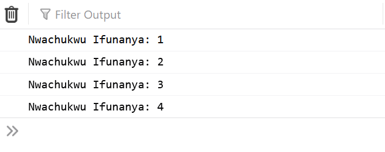
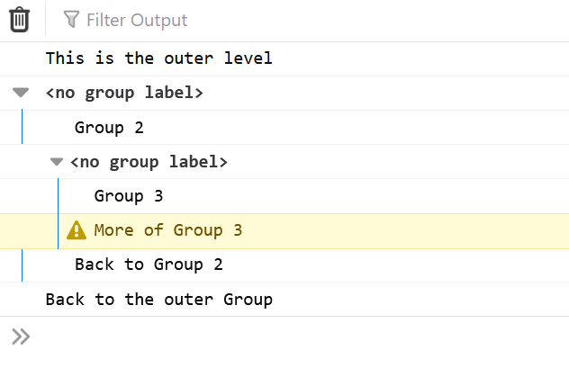

# Javascript Console Methods That will improve your debugging
Alot of us (Javascript developers) have been using the console to debug our applications 
but most of the time what we use most of the time is only console.log but there are other method which you can use in different cases

Today I am going to show you some console methods that will help you debug faster and also 
code faster. 

There are more than 15 console methods you can use and each of them have their unique cases where
they are applied.

## Basic console Logging methods
We will start of with the basic console methods which many of us know about. We will move from the known to the unknown

* Console.log("Log a variable or activity")
* Console.info("shows information")
* Console.warn("Shows warning")
* Console.error("displays errors")

Before you can see the output of this codes you need to open your console and select the appropriate tab to show you any of the above. You can show or hide any of the console method by toggling it.


As you can see from the above image all the tabs are are selected except warning which you can select by toggling it. 

## Examples of Basic Console Logging Methods

Now let's look at example of how to use this javascript basic console to debug our code. 

### Console.log()

As you can see in the picture below that my log tab is selected and that is why the console.log was able to show in the output.

```javascript
    let name = "Nwankwo Ifeanyi";

    console.log("The student name is ", name)
```
### Output


### console.info()

In the picture below, you will see that my info tab is selected. Also you notice the ***i*** icon beside the text which shows that this is info.

```javascript
    console.info("const values cannot be changed...")
```
### Output


### console.warn()
From the picture, you can see the warning side beside the text which shows this is a warning.

```javascript
    console.warn("const values cannot be changed...")
```
### Output


### console.error()

In the picture below, you can see the error sign beside the text and also the text is always in red color to show it is an error.

```javascript
    console.error("Undefined variable name")
```
### output


## Advanced Console Logging method
Now lets look at a bit advanced method of logging in javascript. Sometimes you may want you output to appear in a certain format which might be difficult 
to do using the basic console method syntax. I will
show you how you can customize or format your output.

This can be achieved in two way
* String Formatting
* Color Formatting (using css)

In **String Formatting** you use data types and the values which are placed inside double quote

```javascript
    console.log("Name: %s, Age: %d, Salary: %f", "Nwachukwu Nnamdi", 34, 100.00)
```

In the above example, you will see the use of %s, %d and %f. These are placeholders which represents the values, %s is for string values,  %d is for integer value and  %f is for decimal values.

The second part is the color formatting using css

```javascript
console.log("This is in blue color %c", "color: blue")
```

The %c symbol tells the log method to apply whatever CSS styles are passed as the next argument to the log method to all the text that comes after the %c. 

## Other Console Logging Methods.

We are done with the basic and familiar console methods that we constantly use while debugging. Now lets look at other methods which can also help and improve our debugging skills

### console.table()
Console.table display an array of items or array of json objects into tables 

```javascript
    console.table(["Keyboard", "Mouse", "Monitor"])
```
#### Output


### console.clear()
The clears the console environment if it allows it. 

```javascript
    console.clear()
```
### console.count()
This count the number of times a variable was called or logged to the console

```javascript
    const name = "Nwachukwu Ifunanya"
    console.count(name)
    console.count(name)
    console.count(name)
    console.count(name)
```
#### Output


### console.countReset()
This reset the counter

```javascript
    const name = "Nwachukwu Ifunanya"
    console.count(name)
    console.countReset(name)
```

### console.dir()
This almost work the same way as log but the difference come in their display of html tags. while console.log() display html syntax as tags console.dir displays html syntax as objects.


```javascript
    console.dir(document)
```
#### Output


### console.group()
 The console.group() method creates a new group in the console log, such that any message that logged will be tabbed on the group until console.groupEnd() is called.


```javascript
console.log("This is the outer level");
console.group();
console.log("Group 2");
console.group();
console.log("Group 3");
console.warn("More of Group 3");
console.groupEnd();
console.log("Back to Group 2");
console.groupEnd();
console.log("Back to the outer Group");
```
#### Output


### console.groupCollapsed()
 The console.groupCollapsed() method is the same with group method but it will collapse by default until the user expands it using the disclosure button.

```javascript
console.log("This is the outer level");
console.group();
console.log("Group 2");
console.group();
console.log("Group 3");
console.warn("More of Group 3");
console.groupEnd();
console.log("Back to Group 2");
console.groupEnd();
console.log("Back to the outer Group");
```